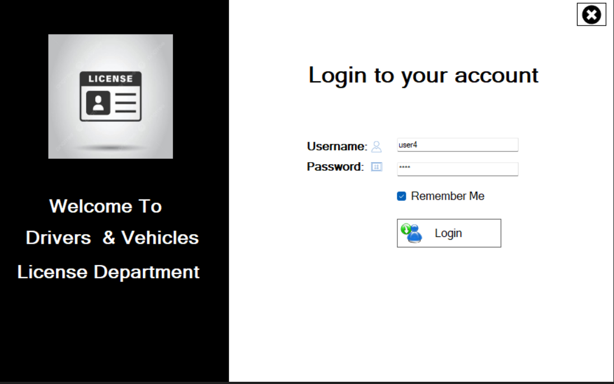
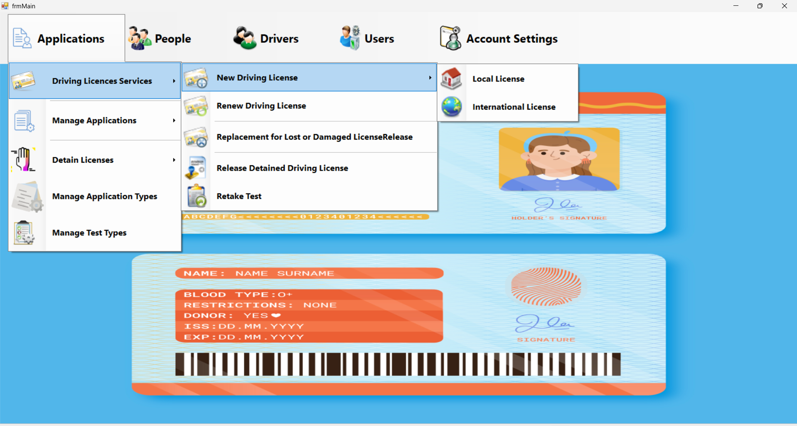
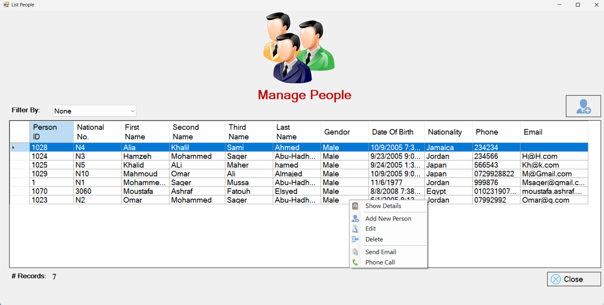
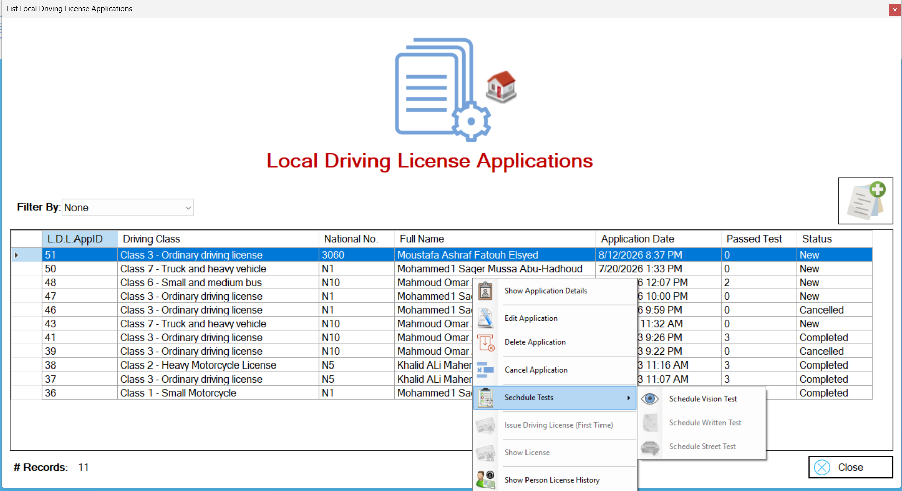
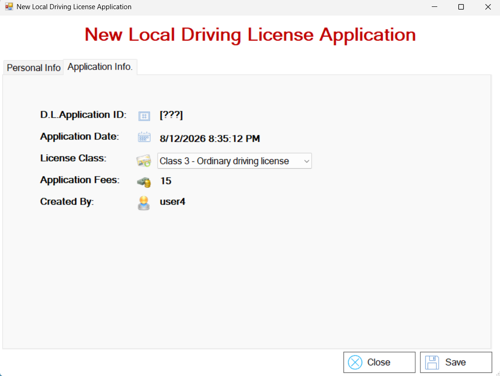
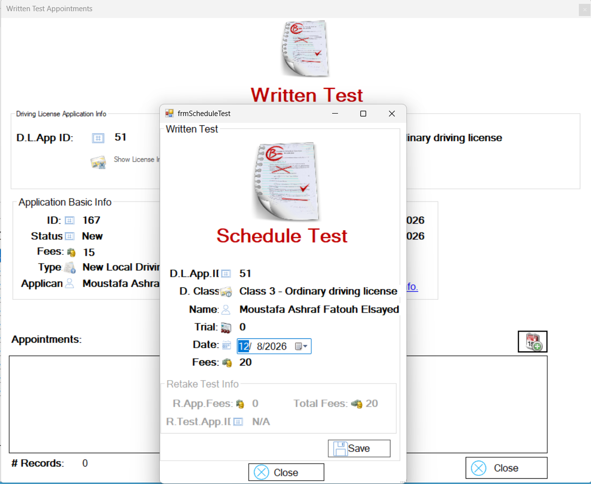
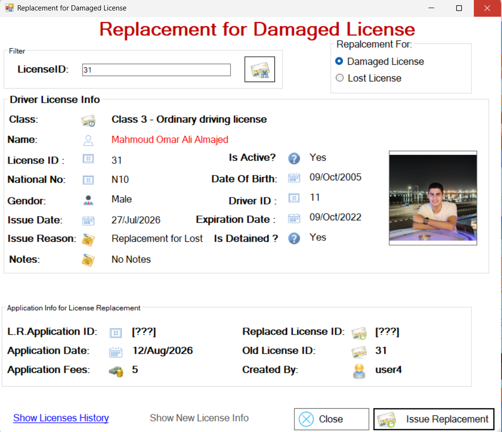
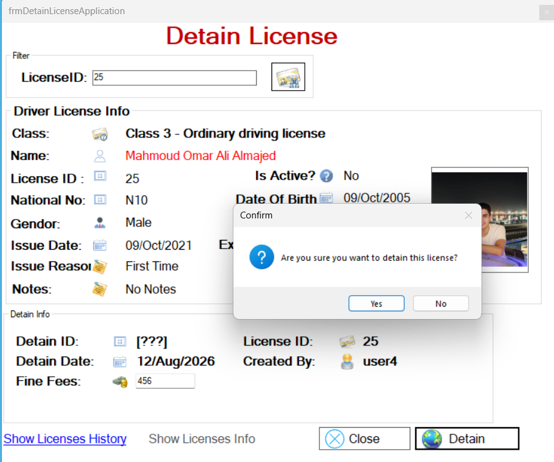
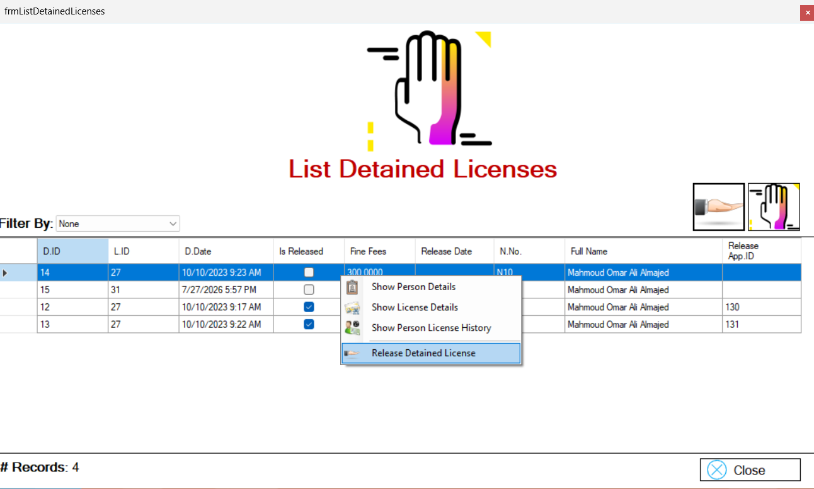

# DVLD - Driving & Vehicle License Department System

A desktop application built with **C# WinForms**, **ADO.NET**, and **SQL Server** that simulates a real-world Driving & Vehicle License Department system.

The project follows a **3-Tier Architecture** and applies **Object-Oriented Programming** principles to build clean, maintainable, and reusable code.

---

## 📸 Screenshots

### Login


### Dashboard


### People Management


### Applications Management


### New Local Driving License


### Written Test & Scheduling


### Take Test


### Replace License


### Detain License


### Detained Licenses


---

## 🛠️ Tech Stack

- C#
- .NET Framework
- Windows Forms (WinForms)
- ADO.NET
- SQL Server
- 3-Tier Architecture
- Object-Oriented Programming (OOP)

---

## 🏗️ Architecture

The application follows a **3-Tier Architecture**:

**Presentation Layer**  
↓  
**Business Logic Layer**  
↓  
**Data Access Layer**  
↓  
**SQL Server Database**

---

## 🚀 Implemented Features

### Authentication & User Management

- Login System
- Remember Me functionality
- Current User Management
- User Management
- User Activation / Deactivation
- Change Password
- User Search & Filtering

### People & Driver Management

- Add, Update, and Delete People
- View Person Details
- Driver Management
- Search & Filtering
- Image Upload and Management
- Input Validation

### Applications & Licensing

- Local Driving License Applications
- International License Applications
- License Issuance
- License Renewal
- License Replacement
- Lost & Damaged License Replacement
- License Detention
- License Release
- License History

### Driving Tests

- Test Scheduling
- Vision Test
- Take Test
- Test Results Management
- Re-test / Retake Workflow

---

## 💡 Concepts Practiced

- Object-Oriented Programming (OOP)
- 3-Tier Architecture
- SOLID Principles
- Data Validation
- Exception Handling
- CRUD Operations
- Authentication & Authorization
- File Handling
- SQL Views
- Stored Procedures
- Business Logic Implementation
- Reusable Components
- Search & Filtering

---

## 📂 Project Structure

```text
Presentation Layer
        ↓
Business Logic Layer
        ↓
Data Access Layer
        ↓
SQL Server Database
